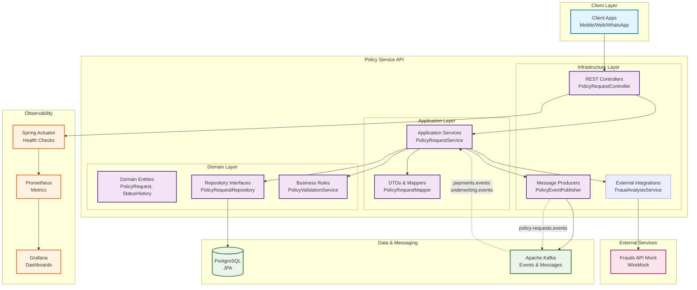
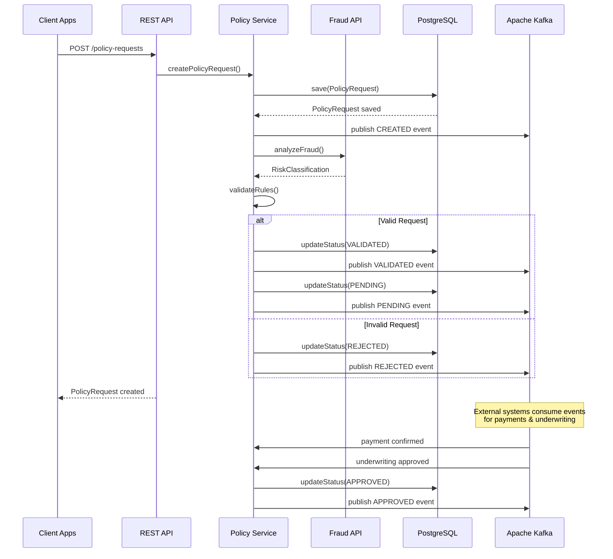
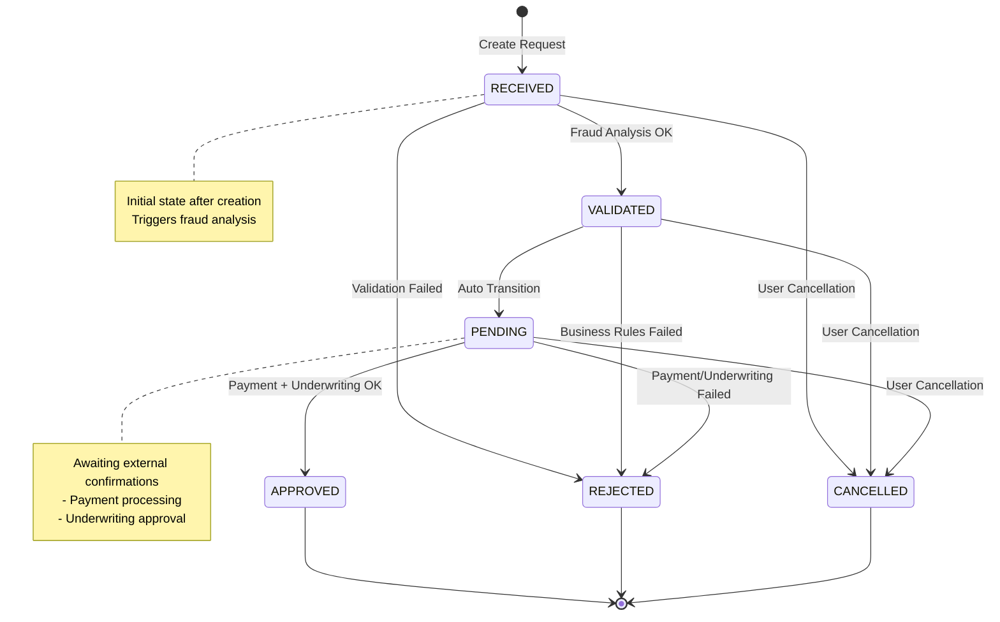

# Diagrama da Arquitetura - Policy Service API

## Arquitetura EDA (Event-Driven Architecture)

## Fluxo de Dados Principal

## Estados da Máquina de Estados

## Componentes por Camada

### Infrastructure Layer
- **REST Controllers**: Endpoints da API REST
- **Message Producers**: Publicação de eventos Kafka
- **External Integrations**: Clientes para APIs externas
- **JPA Repositories**: Implementações de persistência

### Application Layer  
- **Application Services**: Orquestração de casos de uso
- **DTOs**: Objetos de transferência de dados
- **Mappers**: Conversão entre DTOs e entidades

### Domain Layer
- **Entities**: Modelagem rica do domínio
- **Repository Interfaces**: Contratos de persistência  
- **Domain Services**: Regras de negócio complexas
- **Value Objects**: Objetos de valor imutáveis

## Tecnologias por Componente

| Componente | Tecnologia | Propósito |
|------------|------------|-----------|
| **API REST** | Spring Web | Exposição de endpoints HTTP |
| **Persistence** | Spring Data JPA + PostgreSQL | Persistência transacional |
| **Messaging** | Spring Kafka | Comunicação assíncrona |
| **Validation** | Bean Validation | Validação de entrada |
| **Documentation** | OpenAPI 3 + Swagger | Documentação interativa |
| **Testing** | JUnit 5 + Cucumber + TestContainers | Testes automatizados |
| **Observability** | Actuator + Prometheus + Grafana | Monitoramento e métricas |
| **Containerization** | Docker + Docker Compose | Orquestração de containers |

## Padrões de Arquitetura Aplicados

- **Hexagonal Architecture**: Isolamento do domínio
- **Event-Driven Architecture**: Comunicação via eventos  
- **CQRS**: Separação de comandos e consultas
- **Domain-Driven Design**: Modelagem orientada ao domínio
- **Repository Pattern**: Abstração de persistência
- **Factory Pattern**: Criação de objetos complexos
- **Observer Pattern**: Notificação de mudanças de estado